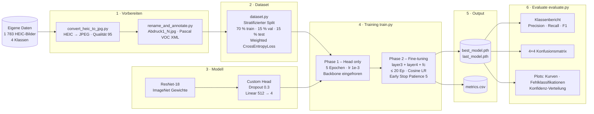
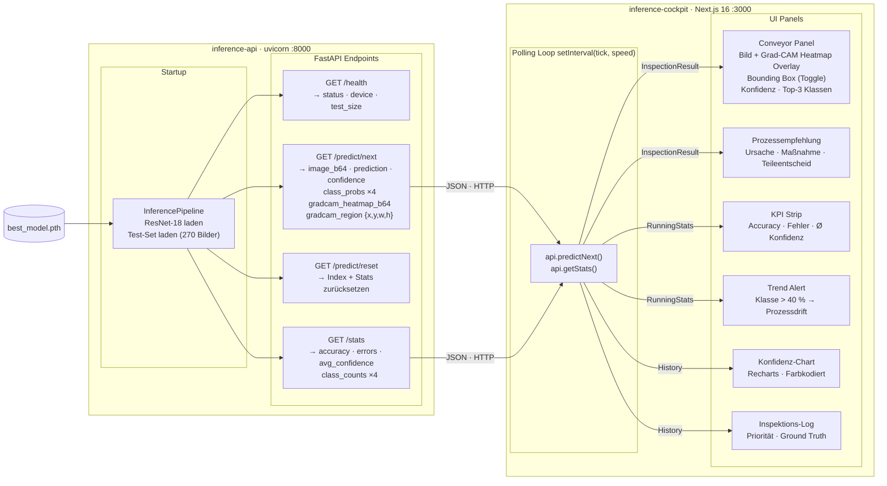

# CNN Surface Defect Classifier

4-Klassen Oberflächendefekt-Klassifikation auf eigenen Produktionsdaten mit ResNet-18 Transfer Learning, einem FastAPI Inference-Service und einem dunklen Echtzeit-Inspektions-Cockpit mit Grad-CAM Erklärbarkeit.

---

## Repository Layout

```
cnn-project/
├── data/                          Gemeinsamer Dataset-Root — git-ignoriert
│   ├── data-new/<klasse>/         Originale HEIC-Bilder (iPhone) — git-ignoriert
│   ├── raw/<klasse>/              Konvertierte JPEG-Bilder — git-ignoriert
│   └── annotations/               Pascal VOC XML Annotationen — git-ignoriert
├── model-training/                PyTorch Training-Pipeline (ResNet-18, 4-Klassen)
│   ├── src/                       dataset · model · train · evaluate · predict
│   ├── scripts/                   convert_heic_to_jpg.py · rename_and_annotate.py
│   ├── outputs/                   checkpoints · logs · plots — git-ignoriert
│   ├── config.py
│   └── requirements.txt
├── inference-api/                 FastAPI Inference-Service
│   ├── api/                       main.py · pipeline.py (inkl. Grad-CAM)
│   ├── src/                       model · dataset
│   ├── config.py
│   └── requirements.txt
└── inference-cockpit/             Next.js 16 Dark-Mode Inspektions-Cockpit
    ├── app/                       Next.js App Router
    ├── lib/                       API-Client · Komponenten · Utils
    └── types/                     TypeScript Typen (inkl. GradCAMRegion)
```

**Datenfluss:**
- `data/data-new/` enthält die Original-iPhone-Bilder (HEIC-Format) pro Klasse.
- `scripts/convert_heic_to_jpg.py` konvertiert sie nach `data/raw/<klasse>/`.
- `scripts/rename_and_annotate.py` benennt die Bilder sequenziell um und erstellt Pascal VOC XML Annotationen.
- Das trainierte Checkpoint (`model-training/outputs/checkpoints/best_model.pth`) wird von `inference-api` geladen.

---

## Defektklassen & Business Logic

| Klasse | Priorität | Ursache | Maßnahme | Teileentscheid |
|---|---|---|---|---|
| **Stanzfehler** | KRITISCH | Werkzeugbruch oder Materialversagen | Linie stoppen — Stanzwerkzeug prüfen und sperren | Ausschuss |
| **Abdruck 2** | HOCH | Erhöhter Werkzeugverschleiß | Verschleiß messen, Oberfläche und Führungen kontrollieren | Ausschuss |
| **Abdruck 1** | MITTEL | Leichte Oberflächenmarkierung | Werkzeugoberfläche prüfen, Schmiermittel kontrollieren | Nacharbeit möglich |
| **i.O.-Teile** | GERING | Kein Defekt erkannt | Keine Maßnahme | Freigabe |

---

## Modellergebnisse

Test-Set: **270 Bilder** (15 % stratifizierter Split, nie im Training gesehen)

| Metrik | Wert |
|---|---|
| **Test Accuracy** | **98.9 %** |
| **Macro F1** | **0.974** |
| **Fehlklassifikationen** | **3 / 270** |

| Klasse | Precision | Recall | F1 | Support |
|---|---|---|---|---|
| Abdruck 1 | 0.92 | 0.96 | 0.94 | 25 |
| Abdruck 2 | 0.99 | 1.00 | 1.00 | 145 |
| Stanzfehler | 1.00 | 0.92 | 0.96 | 24 |
| i.O.-Teile | 1.00 | 1.00 | 1.00 | 76 |

Training: 23 Epochen (5 Phase 1 + 18 Phase 2), bestes Modell bei Epoch 18 (Val F1 = 0.9615).

---

## Voraussetzungen

| Tool | Hinweis |
|---|---|
| Python 3.11+ | `model-training/.venv` und `inference-api/.venv` — getrennte Environments |
| Node.js 18+ | für das Cockpit |
| iPhone-Bilder (HEIC) | in `data/data-new/<klasse>/` ablegen |

**Daten sind nicht im Repo** — `data/` und `model-training/outputs/` sind git-ignoriert.

---

## Quick Start (Windows)

### 1 · Python Environments einrichten

```powershell
# Training
cd model-training
python -m venv .venv
.venv\Scripts\pip install -r requirements.txt

# Inference API
cd ..\inference-api
python -m venv .venv
.venv\Scripts\pip install -r requirements.txt
```

### 2 · Bilder vorbereiten

```powershell
cd model-training

# HEIC → JPEG konvertieren (data/data-new/ → data/raw/)
.venv\Scripts\python scripts/convert_heic_to_jpg.py

# Bilder umbenennen (Abdruck1_1.jpg …) + Pascal VOC XML erstellen
.venv\Scripts\python scripts/rename_and_annotate.py
```

Erwartet folgende Ordnerstruktur in `data/data-new/`:
```
data/data-new/
├── Abdruck 1/    (HEIC-Bilder)
├── Abdruck 2/    (HEIC-Bilder)
├── i.O.-Teile/   (HEIC-Bilder)
└── Stanzfehler/  (HEIC-Bilder)
```

### 3 · Training

```powershell
# Sanity-Check — 2 Epochen
$env:PYTHONUTF8=1; .venv\Scripts\python src/train.py --smoke-test

# Vollständiges Training (Phase 1: 5 ep Head-only + Phase 2: ≤20 ep Fine-tuning)
$env:PYTHONUTF8=1; .venv\Scripts\python src/train.py

# Nach Unterbrechung fortsetzen (resume.pth wird automatisch erkannt)
$env:PYTHONUTF8=1; .venv\Scripts\python src/train.py

# Neustart erzwingen
$env:PYTHONUTF8=1; .venv\Scripts\python src/train.py --restart
```

> **Hinweis:** `$env:PYTHONUTF8=1` ist auf Windows nötig, damit Unicode-Zeichen in der Konsolenausgabe korrekt dargestellt werden.

### 4 · Evaluation

```powershell
$env:PYTHONUTF8=1; .venv\Scripts\python src/evaluate.py
# → Test Accuracy, Macro F1, Klassenbericht, Konfusionsmatrix
# → Plots in model-training/outputs/plots/
```

### 5 · Inference API starten

```powershell
cd ..\inference-api
$env:PYTHONUTF8=1; .venv\Scripts\python -m uvicorn api.main:app --host 127.0.0.1 --port 8000
# http://127.0.0.1:8000/health
```

### 6 · Cockpit starten

```powershell
cd ..\inference-cockpit
npm install       # nur beim ersten Mal
npm run dev
# http://localhost:3000
```

---

## Training Pipeline



---

## Inference Architektur



---

## Grad-CAM Erklärbarkeit

Jede Klassifikation liefert eine visuelle Erklärung, warum das Netz die Entscheidung getroffen hat:

- **Heatmap**: Jet-coloriertes Overlay (Blau → Grün → Gelb → Rot) zeigt welche Bildregion zur Entscheidung beigetragen hat. Berechnet via Gradienten auf `model.layer4` (letzte Convolutional-Schicht vor GlobalAvgPool).
- **Bounding Box**: Gestrichelte Box in der Klassenfarbe um die aktivste Region (Schwelle 50 %).
- **Zwei Checkboxen** im Dashboard zum unabhängigen Ein-/Ausblenden.

Implementierung: Pure PyTorch + NumPy — keine zusätzlichen Abhängigkeiten.

---

## Komponenten

### `model-training/`

```
model-training/
├── src/
│   ├── dataset.py          4-Klassen Loader, stratifizierter Split
│   ├── model.py            ResNet-18 Builder, Freeze/Unfreeze Helper
│   ├── train.py            Zweiphasige Schleife, Weighted Loss, Checkpoint Recovery
│   ├── evaluate.py         Metriken + 4×4 Konfusionsmatrix + Plots
│   └── predict.py          Einzelbild CLI-Inferenz
├── scripts/
│   ├── convert_heic_to_jpg.py   HEIC → JPEG (pillow-heif)
│   └── rename_and_annotate.py   Sequenzielle Umbenennung + Pascal VOC XML
├── outputs/                checkpoints · logs · plots — git-ignoriert
├── config.py               Hyperparameter, Pfade, CLASS_NAMES (4 Klassen)
└── requirements.txt
```

### `inference-api/`

```
inference-api/
├── api/
│   ├── main.py             FastAPI App, CORS, Endpoints
│   └── pipeline.py         InferencePipeline — Modell laden, Test-Set iterieren,
│                           Grad-CAM Heatmap + Bounding Box berechnen
├── src/
│   ├── model.py            build_model() — 4 Ausgaben
│   └── dataset.py          get_test_dataset() Helper
├── config.py               DATA_DIR · CHECKPOINT_DIR · CLASS_NAMES
└── requirements.txt
```

### `inference-cockpit/`

Next.js 16 App Router · Tailwind CSS · Recharts · Dark Industrial HMI Theme.

```
inference-cockpit/
├── app/                    Layout + Seiten
├── lib/
│   ├── api.ts              REST-Client (4 Endpoints)
│   └── components/
│       ├── conveyor-panel.tsx      Bild + Grad-CAM Canvas-Overlay + Checkboxen
│       ├── cockpit-dashboard.tsx   State-Container, Polling-Loop
│       ├── recommendation-card.tsx Prozessempfehlung
│       ├── stats-panel.tsx         Klassenverteilung + Drift-Alert
│       ├── confidence-chart.tsx    Verlaufsgraph (Recharts)
│       ├── inspection-log.tsx      Inspektions-Tabelle
│       ├── alert-banner.tsx        Fehlklassifikations-Banner
│       └── control-bar.tsx         Start/Stop/Reset + Geschwindigkeit
└── types/
    └── inspection.ts       DefectClass · InspectionResult · GradCAMRegion
                            CLASS_COLORS · CLASS_HEX · DEFECT_INFO
```

---

## Hinweise

- **Getrennte venvs**: `model-training/.venv` und `inference-api/.venv` sind vollständig unabhängig. Training-Abhängigkeiten (matplotlib, seaborn, scikit-learn, pillow-heif) sind nicht in der API installiert und umgekehrt.
- **Device**: MPS → CUDA → CPU automatisch gewählt; `NUM_WORKERS=0` vermeidet Windows-Probleme.
- **Klassenimbalance**: `compute_class_weight("balanced")` gewichtet Stanzfehler (156 Bilder) ~6× stärker als Abdruck 2 (963 Bilder) im CrossEntropyLoss.
- **Checkpoint Recovery**: `resume.pth` speichert den vollständigen Trainingszustand (Modell + Optimizer + Scheduler + Epochenzähler) — sicheres Unterbrechen jederzeit möglich.
- **CORS**: API erlaubt `localhost:3000` und `127.0.0.1:3000` — für Produktion `allow_origins` in `inference-api/api/main.py` einschränken.
- **Windows UTF-8**: `$env:PYTHONUTF8=1` vor jedem Python-Aufruf setzen, da die Konsole sonst Unicode-Zeichen in der Trainingsausgabe nicht darstellen kann.
