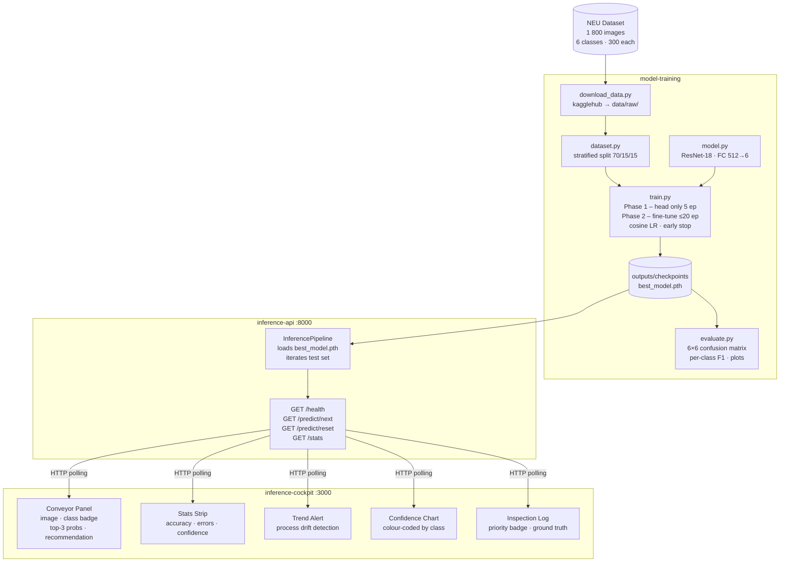

# CNN Surface Defect Classifier

6-class surface defect classification on the NEU steel surface dataset using ResNet-18 transfer learning, a FastAPI inference service, and a dark-mode real-time inspection cockpit.

> **Dataset note:** Every image in the NEU dataset shows a defective surface — there are no "good" samples. The correct task is **defect-type classification** (which of the 6 classes?), not binary defect detection.

---

## Repository Layout

```
cnn-project/
├── model-training/      PyTorch training pipeline (ResNet-18, 6-class)
├── inference-api/       FastAPI inference service
└── inference-cockpit/   Next.js 16 dark-mode inspection cockpit
```

`inference-api` reads `model-training/outputs/checkpoints/best_model.pth` and shares the same Python environment as training.

---

## Prerequisites

| Tool | Notes |
|---|---|
| Python 3.11+ | `model-training/.venv` |
| Node.js 18+ | for the cockpit |
| `~/.kaggle/kaggle.json` | only needed on a machine that has never downloaded this dataset |

**Dataset is not in the repo** — `model-training/data/` and `model-training/outputs/` are git-ignored. Run the download script once before training.

`kagglehub` caches downloads in `~/.cache/kagglehub/`. If the dataset is already cached on your machine, the script works without credentials. Credentials are only required on a fresh machine doing a first-time download.

### Kaggle credentials (first-time download only)

1. [kaggle.com](https://www.kaggle.com) → Settings → API → **Create New Token**
2. Place the file:
   ```bash
   mkdir -p ~/.kaggle && mv ~/Downloads/kaggle.json ~/.kaggle/ && chmod 600 ~/.kaggle/kaggle.json
   ```

---

## Quick Start

### 1 · Python environment

```bash
cd model-training
python3 -m venv .venv
.venv/bin/pip install -r requirements.txt
```

### 2 · Download the dataset

```bash
.venv/bin/python3 scripts/download_data.py
```

Internally this calls:
```python
import kagglehub
path = kagglehub.dataset_download("kaustubhdikshit/neu-surface-defect-database")
```
then merges the Kaggle `train/` + `validation/` splits into `data/raw/<class>/` (1 800 images, 300 per class).

### 3 · Train

```bash
# Sanity check — 2 epochs total, ~40 s on M2 MPS
.venv/bin/python3 src/train.py --smoke-test

# Full training — Phase 1: 5 ep (head only) + Phase 2: ≤20 ep (fine-tune, early stop)
.venv/bin/python3 src/train.py

# Resume after interruption (auto-detects resume.pth)
.venv/bin/python3 src/train.py

# Force restart from scratch
.venv/bin/python3 src/train.py --restart
```

### 4 · Evaluate

```bash
.venv/bin/python3 src/evaluate.py
# → test accuracy, macro F1, per-class report, 6×6 confusion matrix
# → plots saved to model-training/outputs/plots/
```

### 5 · Inference API

```bash
cd ../inference-api
../model-training/.venv/bin/uvicorn api.main:app --host 127.0.0.1 --port 8000 --reload
# http://127.0.0.1:8000/health
```

### 6 · Cockpit

```bash
cd ../inference-cockpit
npm install       # first time only
npm run dev
# http://localhost:3000
```

---

## Defect Classes & Business Logic

| Class | Label | Priority | Process action |
|---|---|---|---|
| inclusion | 1 | **KRITISCH** | Stop line — inspect raw material batch |
| scratches | 5 | HOCH | Check tool wear, guides |
| pitted\_surface | 3 | HOCH | Check coolant & lubrication |
| rolled-in\_scale | 4 | HOCH | Check descaling unit, preheat temp |
| crazing | 0 | MITTEL | Adjust rolling pressure & temperature profile |
| patches | 2 | GERING | Visual check — may be usable for grade B/C customers |

The cockpit surfaces these recommendations live: each classified part shows its root cause, recommended action, and part disposition.

---

## Model

| Metric | Smoke-test (2 ep) |
|---|---|
| Val Accuracy | 99.6 % |
| Val Macro F1 | 0.996 |
| Train time | ~40 s (M2 MPS) |

Full training consistently reaches ≥ 99 % test accuracy. Labels assigned by sorted folder name (alphabetical → 0–5).

---

## Architecture



---

## Component Details

### `model-training/`

```
model-training/
├── src/
│   ├── dataset.py      6-class NEU loader, stratified split
│   ├── model.py        ResNet-18 builder, freeze/unfreeze helpers
│   ├── train.py        Two-phase loop, tqdm, checkpoint recovery
│   ├── evaluate.py     Metrics + 6×6 confusion matrix + plots
│   └── predict.py      Single-image CLI inference
├── scripts/
│   └── download_data.py   kagglehub download + merge train+val splits
├── data/raw/           1 800 images — git-ignored, download via script
├── outputs/            checkpoints + logs + plots — git-ignored
├── config.py           All hyper-parameters, path roots, class names
└── requirements.txt
```

### `inference-api/`

```
inference-api/
├── api/
│   ├── main.py         FastAPI app, CORS, endpoints
│   └── pipeline.py     InferencePipeline — loads model, iterates test set
├── src/
│   ├── model.py        Inference-only build_model() (6 outputs)
│   └── dataset.py      get_test_dataset() helper
├── config.py           Points to ../model-training/outputs/checkpoints
└── requirements.txt
```

### `inference-cockpit/`

Next.js 16 App Router · Tailwind CSS · Recharts · dark industrial HMI theme.  
No configuration needed beyond `npm install`.

---

## Notes

- **Shared venv**: `model-training/.venv` is used for both training and the API.
- **Device**: MPS → CUDA → CPU selected automatically; `NUM_WORKERS=0` avoids macOS fork issues.
- **Checkpoint recovery**: `resume.pth` saves full training state (model + optimizer + scheduler + epoch counter); safe to interrupt at any point.
- **CORS**: API allows all origins in dev — restrict `allow_origins` in `inference-api/api/main.py` for production.
